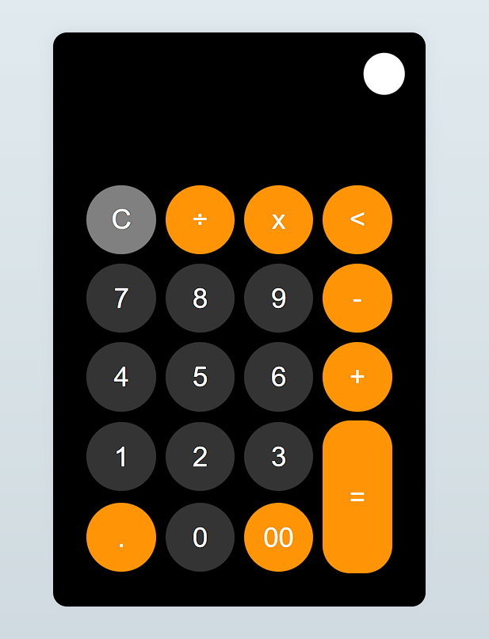

# Calculator with JavaScript

- Project developed as part of educational learning.

- This project was carried out with the purpose of putting into practice basic concepts of web development such as DOM management, basic concepts of JavaScript and style implementation.
- Used technology:
  + HTML 
  + CSS 
  + SCSS 
  + JavaScript 

- Link: [Calculator Kevin Rondon](https://calculator-kevinrondon.netlify.app/ "Calculator Kevin Rondon")

